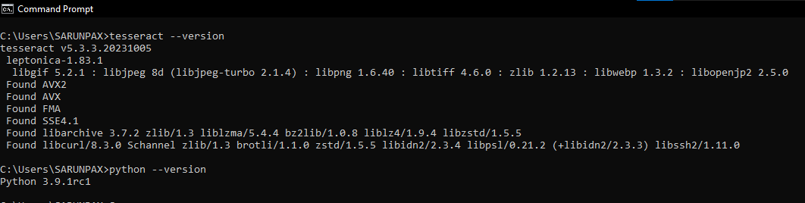
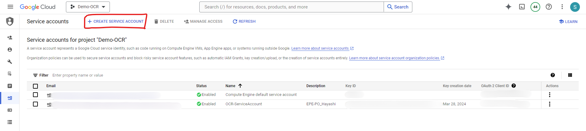

## first step install tesseract

-   How to install tesseract and add PATH [medium.com](https://medium.com/@navapat.tpb/python-3-%E0%B8%95%E0%B8%B4%E0%B8%94%E0%B8%95%E0%B8%B1%E0%B9%89%E0%B8%87%E0%B9%81%E0%B8%A5%E0%B8%B0%E0%B9%83%E0%B8%8A%E0%B9%89%E0%B8%87%E0%B8%B2%E0%B8%99-tesseract-ocr-%E0%B8%AA%E0%B8%B3%E0%B8%AB%E0%B8%A3%E0%B8%B1%E0%B8%9A-window-%E0%B9%80%E0%B8%9E%E0%B8%B7%E0%B9%88%E0%B8%AD%E0%B8%AA%E0%B8%81%E0%B8%B1%E0%B8%94%E0%B8%82%E0%B9%89%E0%B8%AD%E0%B8%84%E0%B8%A7%E0%B8%B2%E0%B8%A1%E0%B8%88%E0%B8%B2%E0%B8%81%E0%B8%A0%E0%B8%B2%E0%B8%9E-734dae2fb4d3)  
-   In this project we use tesseract version 5.3.3.20231005 and python version 3.9.1rc1.    
    

## second step

-   pip install virtualenv
-   mac: virtualenv ocr_rpa , window: python -m venv ocr_rpa
-   mac: source ocr_rpa/bin/activate , window: .\ocr_rpa\Scripts\Activate
-   pip install -r requirements.txt

## third step

-   Create a service account for Google (Cloud Vision API)   
    
-   Then paste json file in the project folder and edit the path in the main.py code in line 131.
